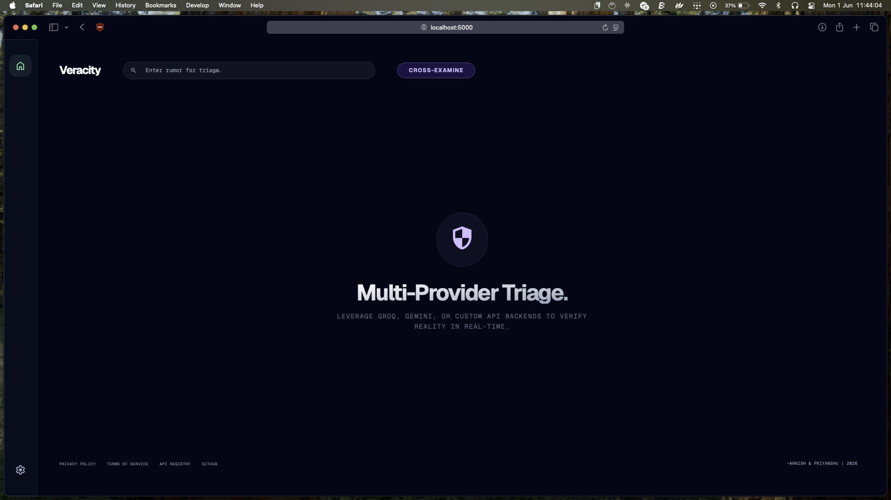
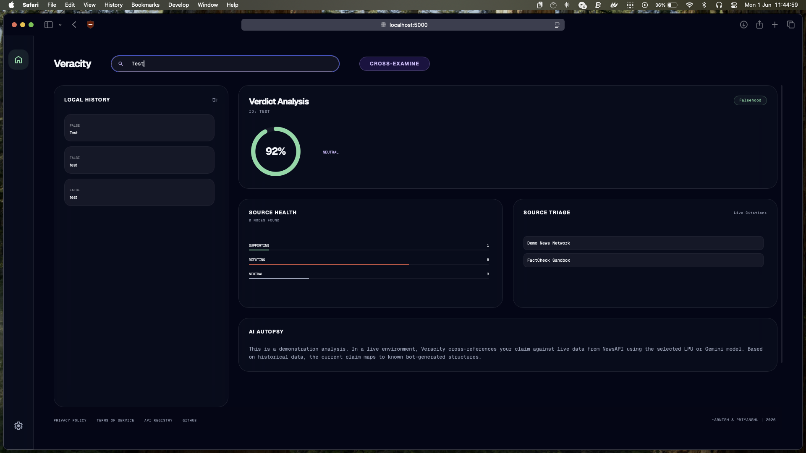

# Veracity: The Universal Truth Engine



> **"Reality isn't what it used to be."**

Veracity is a high-speed, zero-trust fact-checking dashboard. Built to cross-examine rumors, trending claims, and news cycles, it leverages ultra-low latency RAG (Retrieval-Augmented Generation) pipelines powered by live web telemetry. 

Whether you're investigating a political claim, a financial rumor, or a viral tweet, Veracity pulls the latest data from global news sources and runs a multi-provider "AI Autopsy" to give you a definitive verdict.

## ✨ The Aesthetic: Midnight Obsidian & Bento Grids
We designed Veracity to feel like a high-end financial terminal. It features a "Dark Mode First" philosophy, utilizing Aero-Glass panels (30px blur), strict Geist Mono typography, and a fully responsive Bento Grid 2.0 layout. It’s dense with information, yet completely uncluttered.



## 🚀 Key Features

* **Multi-Provider RAG Pipeline:** Don't want to rely on just one AI? Veracity lets you choose your "Brain."
  * **Groq LPU:** For blistering fast, near-instant inference.
  * **Google Gemini:** For massive context windows and robust reasoning.
  * **Custom API (OpenAI Compatible):** Connect to LM Studio, Ollama, or OpenRouter for maximum privacy and local execution.
* **Live Web Telemetry:** Integrates directly with NewsAPI to pull the absolute latest articles as context before making a verdict.
* **The AI Autopsy:** A detailed breakdown explaining *why* the model reached its conclusion, complete with source citations and political bias detection.
* **Local-First History:** Your search history is saved directly to your browser's `localStorage`. No databases, no tracking.
* **Demo Mode:** Just want to see how it looks? Hit the "Demo Mode" button to explore the UI with simulated network delays and mock data—no API keys required.

## 🔒 Zero-Trust Privacy (BYOK)
Veracity uses a **Bring Your Own Key (BYOK)** model. 
1. You input your Groq/Gemini and NewsAPI keys into the browser overlay.
2. The keys are stored in your browser's local cache.
3. The Flask backend only uses them for the exact moment of your query.

**We do not log your keys. We do not track your queries.** The code is fully open-source, so you can verify exactly where your data is going.

## 🛠️ Tech Stack
* **Backend:** Python, Flask, Requests
* **Frontend:** HTML5, Tailwind CSS (via CDN), Vanilla JavaScript
* **AI SDKs:** `groq`, `google-genai`
* **Typography:** Geist & Geist Mono (Vercel)

## 💻 Running it Locally

It takes about 60 seconds to get Veracity running on your machine.

1. **Clone the repo:**
   ```bash
   git clone https://github.com/Tupu4545/Veracity.git
   cd Veracity
   ```
2. **Set up the Python environment:**
   ```bash
   python3 -m venv venv
   source venv/bin/activate
   pip install -r requirements.txt
   ```
3. **Launch the Engine:**
   ```bash
   python3 app.py
   ```
4. Open your browser and navigate to `http://localhost:5000`.

## ☁️ Deploying to Vercel
Veracity is pre-configured for Vercel Serverless deployment. Because of the BYOK architecture, you don't even need to set environment variables on the server.
1. Fork or push this repository to GitHub.
2. Import the project in Vercel.
3. Deploy. (Vercel will automatically read the `vercel.json` and `requirements.txt`).

## 👨‍💻 Creators
Engineered for truth. Made by **~Arnish & Priyanshu**.

---
*Disclaimer: Veracity is an analytical tool. Accuracy is determined by the underlying NewsAPI data and the reasoning capabilities of the selected LLM provider. Always verify critical information independently.*